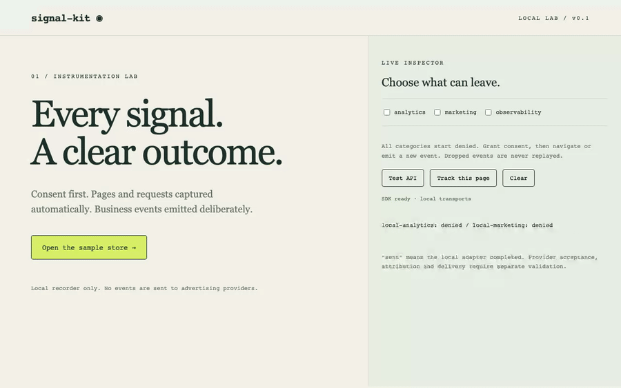

# SignalKit

A consent-aware ecommerce telemetry SDK for Next.js and Bun. Shared typed events, automatic page/request instrumentation and provider adapters, with a platform-independent core.

**Status: alpha candidate `0.1.0-alpha.1`, not yet published to npm.** Tested runtime evidence and limits are listed in [compatibility](docs/COMPATIBILITY.md). No hosted dashboard or collector required by the SDK.

[](https://techinjectindia.github.io/signal-kit/demo.mp4)

The clip uses local recorders: grant consent, navigate, add to cart, call an API, then withdraw consent. No advertising provider receives these demo events.

[Website](https://techinjectindia.github.io/signal-kit/) · [Technical guides](https://techinjectindia.github.io/signal-kit/guides/) · [First contributions](https://github.com/TechInjectIndia/signal-kit/labels/good%20first%20issue)

## Try the local labs

```sh
# Node 22, pnpm 10.24.0, Bun 1.3.4 for Bun fixture
git clone --branch main https://github.com/TechInjectIndia/signal-kit.git
cd signal-kit
pnpm install --frozen-lockfile
pnpm build
pnpm --filter @signalkit/example-nextjs dev
# http://localhost:3100 — consent controls and local inspector
pnpm --filter @signalkit/example-bun dev
# http://localhost:3200 — API and signed payment fixture
```

The examples use local recorders and synthetic data. The Next lab starts with all consent denied. The Bun fixture uses synthetic host consent and SQLite order/outbox persistence; real hosts supply their own order state and consent.

## What is included

- Typed product_view, add_to_cart, begin_checkout and purchase events; runtime payload validation.
- Browser initial/navigation pages and fetch/XHR failures, status and duration.
- Bun incoming handler and server outbound fetch instrumentation with trace correlation.
- Next React root provider and separate Node OpenTelemetry registration for automatic framework requests.
- GA4, Meta Pixel/CAPI stable event IDs, optional Clarity and OTLP HTTP JSON.
- Denied consent defaults, withdrawal hooks, safe fields/routes, bounded dispatch and per-provider diagnostics.
- Signed Razorpay reference webhook, trusted order checks and durable replay-tested outbox.

Marketing providers receive page/business events; technical requests go to configured observability. Purchases must come from verified host state. Runtime tracking is best effort; the host owns consent, durable retry and business correctness. Third-party scripts require their own privacy/masking settings. No credentials belong browser configuration.

```ts
await signals.track({
  name: 'purchase',
  eventId: persistedOrder.eventId,
  properties: {
    transaction_id: persistedOrder.id,
    currency: 'INR',
    value: 450,
    items: [{ item_id: 'notebook', price: 450, quantity: 1 }],
  },
});
```

The owner-selected package scope is `@techinject`; packages are not published yet. Use the workspace or verified local alpha tarballs. See the [integration guide](packages/features/signals/INTEGRATION.md) for provider settings and limitations.

## Platform availability

The SDK is designed around platform-independent contracts. Next.js and Bun are the current alpha integrations; the dedicated integrations below are **coming soon**, pending development. No release dates are committed. Planned platforms do not yet have verified installation recipes or native SDKs.

| Platform                          | Status             | Integration scope                                                     |
| --------------------------------- | ------------------ | --------------------------------------------------------------------- |
| Next.js App Router (Node runtime) | Available in alpha | Browser provider and separate Node instrumentation; examples below    |
| Bun                               | Available in alpha | Wrapped incoming handlers and explicit outbound fetch; examples below |
| SvelteKit                         | Coming soon        | Framework adapter and integration examples                            |
| Hono                              | Coming soon        | Framework adapter and integration examples                            |
| Astro                             | Coming soon        | Framework adapter and integration examples                            |
| Node.js (standalone)              | Coming soon        | Dedicated generic server integration and examples                     |
| HTML / vanilla JavaScript         | Coming soon        | Standalone browser setup and integration examples                     |
| Django (Python)                   | Coming soon        | Native Python SDK and framework adapter                               |
| Laravel (PHP)                     | Coming soon        | Native PHP SDK and framework adapter                                  |
| FastAPI                           | Coming soon        | Dedicated integration and examples pending development                |
| Spring Boot                       | Coming soon        | Dedicated integration and examples pending development                |
| Express                           | Coming soon        | Dedicated integration and examples pending development                |
| NestJS                            | Coming soon        | Dedicated integration and examples pending development                |
| CodeIgniter                       | Coming soon        | Dedicated integration and examples pending development                |
| Vue                               | Coming soon        | Dedicated integration and examples pending development                |
| Angular                           | Coming soon        | Dedicated integration and examples pending development                |
| Fastify                           | Coming soon        | Dedicated integration and examples pending development                |

The portable browser/server building blocks already exist, but that does not establish support for the coming-soon hosts. Next Edge remains deferred and unsupported.

[Web integrations and platform roadmap](https://techinjectindia.github.io/signal-kit/integrations/) · [Full integration documentation](packages/features/signals/INTEGRATION.md)

## Integration examples

[Choose your platform](https://techinjectindia.github.io/signal-kit/docs/) · [Next.js guide](https://techinjectindia.github.io/signal-kit/docs/nextjs/) · [Bun guide](https://techinjectindia.github.io/signal-kit/docs/bun/) · [Complete integration guide](packages/features/signals/INTEGRATION.md) · [Next.js lab](examples/nextjs) · [Bun lab](examples/bun)

Build the workspace first using the commands above. For a fresh external test project, run `pnpm release:prepare`, then `node artifacts/0.1.0-alpha.1/install-local.mjs /path/to/fresh-consumer`. That installer refuses to overwrite an existing package.json; existing applications need the seven local tarballs and matching local package overrides described in the [alpha install plan](docs/releases/0.1.0-alpha.1.md). No registry install is available yet.

### Configure the Next.js client provider

Replace the public GA4 measurement ID with your own. Consent begins denied; enable it through your host consent manager. Never put server credentials here.

**app/providers.tsx**

```tsx
'use client';
import { SignalKitProvider, createGA4Provider } from '@techinject/nextjs';

const config = {
  providers: [createGA4Provider({ measurementId: 'G-YOURID' })],
  consent: { analytics: false, marketing: false, observability: false },
};

export function Providers({ children }: { children: React.ReactNode }) {
  return <SignalKitProvider config={config}>{children}</SignalKitProvider>;
}
```

### Wire the Next.js root layout

Use the Providers client component shown above. Mount it once around the application; keep this root layout a server component.

**app/layout.tsx**

```tsx
import type { ReactNode } from 'react';
import { Providers } from './providers';

export default function RootLayout({ children }: { children: ReactNode }) {
  return (
    <html lang="en">
      <body>
        <Providers>{children}</Providers>
      </body>
    </html>
  );
}
```

### Apply consent and track an add-to-cart event

Synthetic interaction example: consent stays denied until the visitor clicks Allow. In production, replace the demo buttons with your consent manager and persist its choices. Call track after the host cart update succeeds. This uses the GA4 provider configured above; no server secret is needed.

**app/cart-demo.tsx**

```tsx
'use client';
import { useSignals } from '@techinject/nextjs';

export function CartDemo() {
  const signals = useSignals();
  return (
    <>
      <button
        onClick={() =>
          signals.setConsent({
            analytics: true,
            marketing: false,
            observability: false,
          })
        }
      >
        Allow analytics
      </button>
      <button
        onClick={() =>
          signals.setConsent({
            analytics: false,
            marketing: false,
            observability: false,
          })
        }
      >
        Withdraw analytics
      </button>
      <button
        onClick={async () => {
          const outcomes = await signals.track({
            name: 'add_to_cart',
            properties: {
              currency: 'INR',
              value: 450,
              items: [{ item_id: 'notebook', price: 450, quantity: 1 }],
            },
          });
          console.log(outcomes); // Safe SDK outcomes; not proof of attribution.
        }}
      >
        Record demo add to cart
      </button>
    </>
  );
}
```

### Enable Next.js Node request telemetry

Set SIGNALKIT_OTEL_ENABLED=true and OTEL_EXPORTER_OTLP_ENDPOINT in server-only host configuration to enable this. Use your own OTLP collector and its credentials. This global framework tracing is host-owned and independent of browser consent; retain an existing tracing setup instead of registering twice. Next Edge is unsupported.

**instrumentation.ts (project root, or src/ when using src/app)**

```ts
export async function register() {
  if (process.env.NEXT_RUNTIME === 'nodejs' && process.env.SIGNALKIT_OTEL_ENABLED === 'true') {
    const { registerNextInstrumentation } = await import('@techinject/nextjs-server');
    registerNextInstrumentation({ serviceName: 'shop-nextjs' });
  }
}
```

### Run Bun API tracking without a collector

Save this file inside the built workspace and run pnpm --filter @signalkit/example-bun exec bun trace-demo.ts. Visit http://localhost:3300/orders/demo to see a local request record with /orders/:id. Observability is enabled for this synthetic fixture; production hosts supply their own policy. Wrap each routes-table handler too, because those bypass fallback fetch.

**examples/bun/trace-demo.ts**

```ts
import { createServerSignals } from '@techinject/server';
import { instrumentBunFetch } from '@techinject/bun';

const signals = createServerSignals({
  consent: { analytics: false, marketing: false, observability: true },
  observer: {
    record(record) {
      console.log(record);
    },
  },
  excludeUrls: ['/health'],
});
const server = Bun.serve({
  port: 3300,
  fetch: instrumentBunFetch(
    signals,
    (request) => {
      const path = new URL(request.url).pathname;
      if (path === '/health') return Response.json({ ok: true });
      if (path.startsWith('/orders/')) return Response.json({ ok: true });
      return new Response('Not found', { status: 404 });
    },
    (request) => (new URL(request.url).pathname.startsWith('/orders/') ? '/orders/:id' : undefined),
  ),
});
process.on('SIGINT', async () => {
  server.stop();
  await signals.flush();
  signals.dispose();
  process.exit(0);
});
```

For GA4, disable Enhanced Measurement automatic history page changes when SignalKit emits pages. Denied pages are dropped without replay. For a current-page event after consent, explicitly call `signals.track({ name: 'page_view', properties: { page_path: window.location.pathname } })` after updating consent. Browser fetch/XHR observations also need observability consent and a configured observer.

For verified purchases and server-only Meta CAPI, follow the [purchase guide](https://techinjectindia.github.io/signal-kit/guides/nextjs-purchase-tracking/) and [shared Meta event ID guide](https://techinjectindia.github.io/signal-kit/guides/meta-pixel-capi-event-ids/).

## Verify and contribute

```sh
pnpm check
pnpm format:check
pnpm build
pnpm typecheck
pnpm test
pnpm test:boundaries
pnpm test:packages
pnpm test:bundle
pnpm exec playwright install chromium
pnpm test:e2e
pnpm test:next-otel
```

Local socket tests require permission to listen on localhost. Each leaf owns build, types and tests. Root Turbo delegates and caches builds; runtime tests are uncached. Prettier enforces consistent source and documentation formatting; the text-format script remains available for basic text hygiene. Read [contributing](CONTRIBUTING.md), [maintenance](docs/MAINTAINING.md) and [governance](GOVERNANCE.md).

[PRD](docs/PRD.md) · [architecture](docs/ARCHITECTURE.md) · [FRD](docs/frd/signals.md) · [design](packages/features/signals/DESIGN.md) · [roadmap](docs/ROADMAP.md)

Report bugs through issue templates. For vulnerabilities use [private vulnerability reporting](https://github.com/TechInjectIndia/signal-kit/security/advisories/new); never post credentials or customer payloads. [Security policy](SECURITY.md) · [support](SUPPORT.md) · [code of conduct](CODE_OF_CONDUCT.md)

MIT licensed. GA4/Meta/Clarity and collector accounts remain governed by their providers' terms. No live attribution, provider dedup or universal framework support claim.

## Public website

[SignalKit website](https://techinjectindia.github.io/signal-kit/) explains the SDK, quickstart, integrations and FAQs. Static HTML/CSS source lives in apps/site, separate from the local noindex lab. Build/preview with pnpm --filter @signalkit/site build/dev. See [site operations](docs/PUBLIC-SITE.md) for canonical URL, deployment and discovery details.

## Alpha and pilot participation

[Alpha review and install plan](docs/releases/0.1.0-alpha.1.md) · [Pilot developer handoff](docs/growth/PILOT-GUIDE.md) · [Maintenance routine](docs/growth/MAINTAINER-SOP.md). Report a concrete installation problem; stars are welcome, but real usage and useful feedback matter more.
