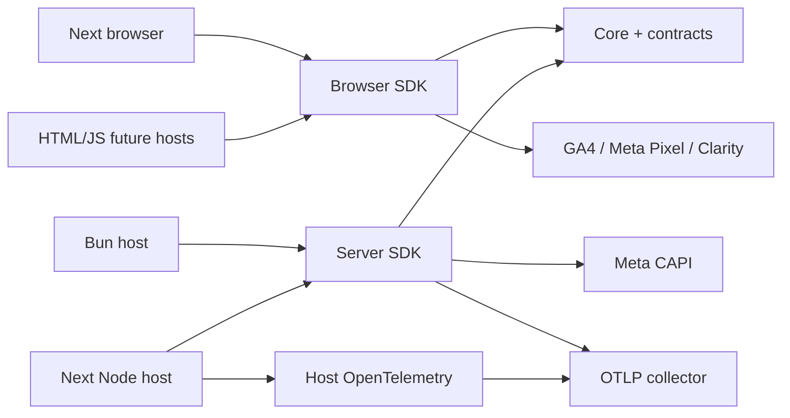

# SignalKit architecture

Implementation baseline, 2026-10-05, under the founder's explicit end-to-end build authorization. Upstream agreed scope: [PRD](PRD.md). Engineering decisions remain identifiable below; this document does not imply separate product-owner approval of every detail.

## Hosts and ownership

SignalKit ships embeddable libraries, no hosted service. Two independently runnable local consumer hosts: Next.js lab and Bun API/payment fixture. This is an explicit scope exception to a full application bootstrap: no empty standalone API/dashboard/database deployment. Hosts own identity, payment verification, storage, consent, retries, configuration and deployment.

| Package                  | Consumer           | Responsibility                                  |
| ------------------------ | ------------------ | ----------------------------------------------- |
| @signalkit/contracts     | all                | independent Zod schemas and DTOs                |
| @signalkit/core          | adapters           | consent, validation, dispatch, IDs, safe routes |
| @signalkit/browser       | browser/HTML hosts | pages, fetch/XHR and public providers           |
| @signalkit/server        | Node/Bun hosts     | request wrapper, outbound fetch, CAPI, OTLP     |
| @signalkit/nextjs        | Next browser       | root React provider/useSignals                  |
| @signalkit/nextjs-server | Next Node          | host OTel registration and safe error hook      |
| @signalkit/bun           | Bun                | Bun.serve fetch wrapper                         |

Packages are one portable signals feature family, with framework dependencies confined to adapters. Core imports contracts only; contracts imports Zod only. Client and server Next packages are separate dependency graphs. Consumers import public exports; ESM builds and declarations belong each leaf. No process.env reads in SDK core/adapters: hosts inject config. Bun demo alone owns SQLite fixture persistence; production persistence is not an SDK feature.

## Trust and data boundaries

Browser receives public IDs only. CAPI access token, OTLP headers, webhook secret and order database remain server-only. Raw bodies/headers/error messages never become telemetry. Routes sanitized; configure explicit templates for sensitive arbitrary slugs. Third-party scripts need host privacy/masking settings. No identity API or automatic matching data extraction.

Marketing uses event IDs for business duplication; traces link technical requests only. Host verified order plus durable outbox decide purchase. Demo unique order outbox prevents repeated business-event creation, while retries remain at least once with stable IDs; distributed exactly-once delivery is not promised.

## Runtime and rollout

Initial verified fixture targets Node22, Next version recorded in compatibility, Bun1.3.4. Browser needs modern fetch, crypto.randomUUID, structuredClone; older browsers need host polyfills. No Edge/native Python/PHP promise. SSR imports safe; browser start is client-only. Structural React config is init-only: remount to change provider/observer config, update consent through config or setConsent.

Next automatic incoming spans use @vercel/otel through instrumentation.ts. Enable host technical telemetry deliberately under its own lawful processing policy, configure collector redaction, avoid competing global tracer registrations. SignalKit business/browser consent does not control an independently registered global OTel provider. Optional SigNoz collector accepts OTLP; its hosting/auth/residency is host-owned.

Build graph and import boundary checks belong [maintenance](MAINTAINING.md). Demo is noindex, semantic and locally rendered, with [visual foundation](DESIGN_SYSTEM.md). Remove provider registration/root wrapper to roll back; dispose restores owned browser patches. SDK upgrades require tests against every claimed runtime.

Behavior: [FRD](frd/signals.md). Algorithms/contracts and host wiring: [feature design](../packages/features/signals/DESIGN.md), [integration guide](../packages/features/signals/INTEGRATION.md).
